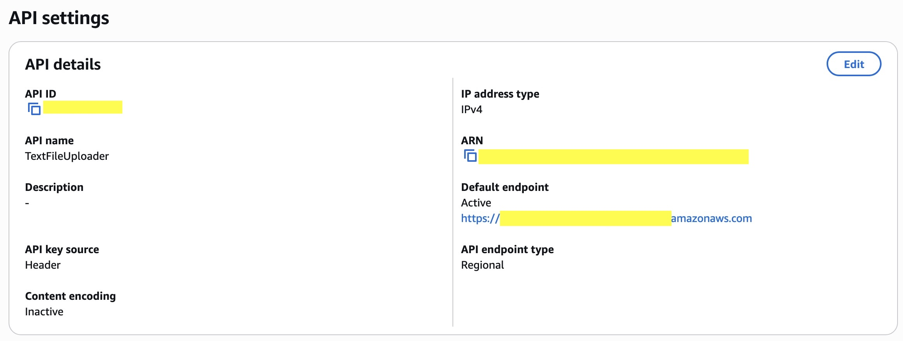

# AWS StudyNotes2Audio

My biggest personal project, a serverless text-to-speech conversion system that transforms your study notes into portable audio files using AWS Lambda, Amazon Polly, and S3.

---

## The Challenge
As a cybersecurity student, I'm constantly juggling between lectures, labs, and practical projects. Reading through pages of study notes during my commute was inefficient and quite boring for me.

I needed a solution that could:
- **Convert text notes to audio** - Listen while walking, driving, or exercising
- **Work automatically** - No manual conversion processes
- **Be accessible anywhere** - Stream audio from any device
- **Handle any study material** - From cybersecurity concepts to cloud architecture notes

---

## My Steps

**1. Setting Up the Storage and Compute Layer**  
I created an S3 bucket for file storage and two Lambda functions, one for handling API requests and another for text-to-speech processing.
- S3 bucket with organized prefixes: `notes/files/` for text uploads and `audio/` for generated MP3s
- API Gateway + Lambda for secure pre-signed URL generation
- Event-driven Lambda for automated Polly processing

---

**2. Building the Upload API (LambdaApiFunction.py)**  
The first Lambda function handles secure file uploads by:
- **Validating** file types (only .txt files allowed)
- **Generating** pre-signed URLs for direct S3 uploads
- **Setting** appropriate CORS headers for web access
- **Implementing** security best practices with 10-minute URL expiration

  
[View API Lambda code](LambdaApiFunction.py)

---

**3. Creating the Text-to-Speech Processor (LambdaFuncion.py)**  
The core processing Lambda function:
- **Listens** for S3 PUT events on the `notes/files/` prefix
- **Reads** uploaded text content from S3
- **Converts** text to speech using Amazon Polly (Joanna voice)
- **Stores** the generated MP3 in the `audio/` folder
- **Prevents** duplicate processing with existence checks

  
[View Processing Lambda code](LambdaFuncion.py)

---

**4. Building the Web Interface**  
I created a responsive web frontend that:
- **Validates** file selection (.txt files only)
- **Requests** secure upload URLs from the API
- **Uploads** files directly to S3 using pre-signed URLs
- **Monitors** audio generation progress with automatic polling
- **Provides** direct links to generated audio files

  
[View complete web files](Website_Files/)

---

**5. Configuring Event-Driven Architecture**  
Set up S3 event notifications to trigger the processing Lambda:
- **Event type**: PUT Object
- **Prefix filter**: `notes/files/`
- **Suffix filter**: `.txt`

---

**6. Setting Up Security and Permissions**  
The Lambda functions require specific IAM permissions:
- **S3 permissions**: GetObject, PutObject for file handling
- **Polly permissions**: SynthesizeSpeech for text-to-speech conversion
- **CloudWatch permissions**: For logging and monitoring

---

**7. Testing the Complete Pipeline**  
When I upload a study note:
- Frontend requests secure upload URL
- File uploads directly to S3
- S3 event triggers processing Lambda
- Polly converts text to high-quality MP3
- Audio file becomes available for streaming/download

---

## Tech Stack:
- **AWS Lambda** (Python 3.x) - Serverless compute for API and processing
- **Amazon S3** - File storage with event notifications
- **Amazon Polly** - Neural text-to-speech conversion
- **API Gateway** - RESTful API for secure file upload requests
- **HTML/CSS/JavaScript** - Responsive web interface

---

## Security Features Implemented

**Input Validation:**
- File type restrictions (only .txt files)
- Filename sanitization and validation
- Content-Type enforcement

**Access Control:**
- Pre-signed URLs with limited expiration (10 minutes)
- CORS configuration for controlled web access
- IAM least-privilege principle for Lambda execution roles

**Error Handling:**
- Comprehensive exception handling in both Lambda functions
- User-friendly error messages without information disclosure
- Duplicate file processing prevention

---

## Performance Optimizations

**Current Setup:**
- Pre-signed URLs eliminate server-side file handling
- Direct S3 uploads reduce Lambda execution time
- Asynchronous processing with event-driven architecture
- Frontend polling with exponential backoff (15 checks, 3-second intervals)

**Architecture Improvements for Scale:**
- CloudFront CDN for audio file delivery
- SQS integration for high-volume processing
- Lambda memory optimization based on file sizes
- Cost optimization with S3 lifecycle policies

---

## What I Learned

**Cloud Security:**
- How to implement secure file upload patterns with pre-signed URLs
- Importance of input validation and CORS configuration
- IAM role design following least-privilege principles

**Serverless Architecture:**
- Event-driven design patterns for scalable applications
- Cost-effective serverless computing with pay-per-use model
- Integration patterns between multiple AWS services

**Full-Stack Development:**
- Asynchronous JavaScript programming for better UX
- Error handling across distributed systems
- API design for secure client-server communication

---

## Future Enhancements

**Ideas for new Features:**
- **Multi-language support** - Detect language and select appropriate Polly voice
- **Audio transcription reverse mode** - Convert audio back to searchable text
- **User authentication** - Personal study note libraries
- **Mobile app** - Native iOS/Android applications
- **Study analytics** - Track listening habits and learning progress

---

## Network Issues (Currently Being Resolved)
The system is architecturally sound but experiencing intermittent connectivity issues between the frontend and API Gateway. The Lambda functions process files correctly when triggered directly. This appears to be related to CORS configuration or API Gateway routing - debugging in progress.

---

**Personal Links:**
[LinkedIn](https://www.linkedin.com/in/nazariy-buryak-778433350/) | [GitHub](https://github.com/K0NGR3SS)
